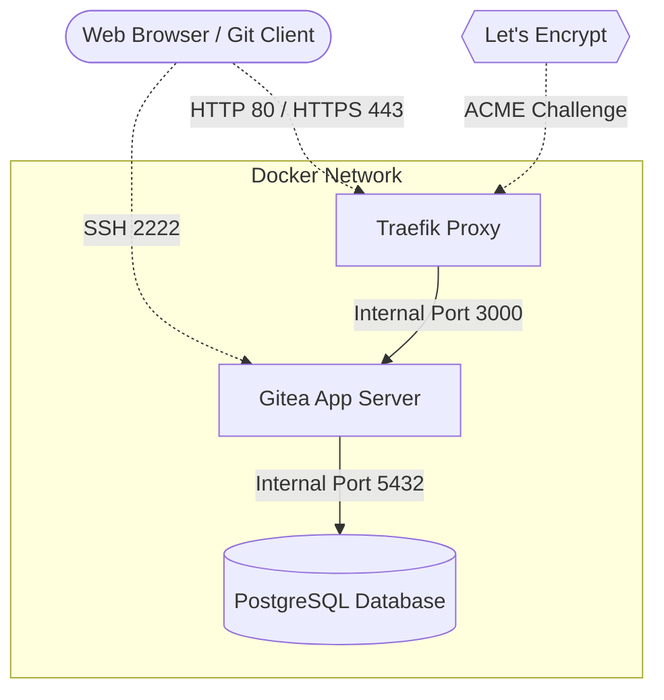

# Gitea with Traefik (HTTPS Setup)

A production-ready Docker Compose configuration for deploying **Gitea** (a self-hosted Git service) with **PostgreSQL**, secured automatically by **Traefik** using Let's Encrypt SSL certificates.

---

## 🏗 Architecture Overview



This deployment utilizes three distinct containers operating within an isolated Docker network:

*   **Traefik (Reverse Proxy):** Acts as the edge router. It listens on public ports `80` (HTTP) and `443` (HTTPS), automatically redirecting HTTP traffic to HTTPS. It intercepts traffic intended for your domain and routes it internally to the Gitea container. It also handles automated Let's Encrypt certificate generation and renewal.
*   **Gitea (Application):** The Git web interface and server. It communicates with Traefik via Docker labels to dynamically register its routing rules. It exposes port `2222` to the host strictly for SSH Git operations (e.g., `git clone git@...`).
*   **PostgreSQL (Database):** The backend database for Gitea. It is entirely isolated from the public internet and is only accessible by the Gitea container on the internal Docker network.

---

## 📋 Prerequisites

Before deploying this stack, ensure the following requirements are met:

1.  **Docker Environment:** Docker and Docker Compose must be installed on your server.
2.  **Domain Name:** A registered domain name (e.g., `git.example.com`).
3.  **DNS Configuration:** An `A Record` for your domain pointing to the public IP address of your server.
4.  **Network Access (Firewall):** You must allow incoming traffic on the following TCP ports:
    *   **Port 80:** HTTP web traffic / Let's Encrypt validation.
    *   **Port 443:** HTTPS secure web traffic.
    *   **Port 2222:** SSH traffic for Git cloning.

---

## ⚙️ Configuration

Before starting the services, you must update the placeholder values in the `docker-compose.yml` file.

1.  **Let's Encrypt Email Registration:**
    Traefik requires an email address for Let's Encrypt certificate expiration notices. Update the `traefik` command section:
    ```yaml
    - "--certificatesresolvers.myresolver.acme.email=your-email@example.com" # Replace with your email
    ```

2.  **Gitea Environment Variables:**
    Update the Gitea server configuration to match your domain:
    ```yaml
    - GITEA__server__DOMAIN=git.example.com            # Replace with your domain
    - GITEA__server__ROOT_URL=https://git.example.com/ # Replace with your full domain URL
    ```

3.  **Traefik Routing Rules:**
    Update the Traefik label on the `gitea` service to listen for your domain:
    ```yaml
    - "traefik.http.routers.gitea.rule=Host(`git.example.com`)" # Replace with your domain
    ```

---

## 🚀 Deployment

1.  **Start the Services:**
    Launch the stack in detached mode:
    ```bash
    docker-compose up -d
    ```

2.  **Monitor SSL Provisioning:**
    Traefik will automatically begin the ACME challenge to acquire your SSL certificate. You can monitor this process in the logs:
    ```bash
    docker logs -f traefik
    ```

3.  **Access Gitea:**
    Once the certificate is successfully acquired, navigate to `https://git.example.com` in your browser. You will be greeted by the Gitea initial configuration screen, secured with a valid SSL certificate.

---

## 💾 Data Persistence and Backups

Data persistence is managed via local bind mounts in the `./data` directory relative to the `docker-compose.yml` file. 

*   `./data/gitea`: Stores Git repository data, custom templates, and Gitea configuration.
*   `./data/postgres`: Stores the PostgreSQL database files.
*   `./data/letsencrypt`: Stores `acme.json`, containing your SSL certificates to prevent rate-limiting from Let's Encrypt upon container restarts.

**Important:** Ensure you regularly back up the entire `./data` directory to prevent data loss.

---

## 💾 Backups

There are two primary ways to back up your Gitea instance:

### Method 1: The Simple Directory Backup (Recommended for most)
Because all state is contained in the `./data` directory, the easiest way to backup everything is to stop the containers and zip the folder:
```bash
# 1. Stop the containers so no new data is written during the backup
docker-compose down

# 2. Compress the docker-compose.yml and the data directory
tar -czvf gitea-backup-$(date +%F).tar.gz docker-compose.yml data/

# 3. Start the containers back up
docker-compose up -d
```
You can automate this via a simple Cron job and push the `.tar.gz` to a cloud storage bucket.

### Method 2: The Official Gitea Dump Tool
If you don't want to stop your containers, you can use Gitea's built-in dump utility. This automatically creates a snapshot of **both** your Postgres database and your Git repositories into a single zip file:
```bash
docker exec -u git -it gitea bash -c "gitea dump -c /data/gitea/conf/app.ini --file /tmp/gitea-dump.zip"
docker cp gitea:/tmp/gitea-dump.zip ./gitea-dump.zip
```
*Note: This does not backup your Traefik SSL certificates.*

### Method 3: Direct PostgreSQL Dump (`pg_dump`)
If you prefer to back up just the raw SQL data from your database (while the container is still running), you can execute `pg_dump` directly inside the Postgres container:
```bash
docker exec -t gitea-postgres pg_dump -U gitea gitea > gitea_db_backup_$(date +%F).sql
```
To restore this SQL file later, you would use:
```bash
cat gitea_db_backup_2024-01-01.sql | docker exec -i gitea-postgres psql -U gitea -d gitea
```

---

## 🚚 Migration (Moving to another Cloud)

Migrating to a new server (like GCP, AWS, or DigitalOcean) is incredibly straightforward using **Method 1** above. You essentially just move the `docker-compose.yml` and the `./data` folder to the new machine.

### Step-by-Step Migration Guide:

1. **Stop the current services:** On your old server, spin down the containers.
   ```bash
   docker-compose down
   ```

2. **Zip the directory:** Compress your configuration and data.
   ```bash
   tar -czvf gitea-backup.tar.gz docker-compose.yml data/
   ```

3. **Transfer to the new server:** Use `scp`, `rsync`, or a cloud storage bucket to move the `.tar.gz` file to your new server.
   ```bash
   scp gitea-backup.tar.gz user@new-server-ip:~
   ```

4. **Extract and Run on the new server:**
   SSH into your new server, extract the files, and start it up!
   ```bash
   tar -xzvf gitea-backup.tar.gz
   cd Gitea
   docker-compose up -d
   ```

5. **Update DNS:** Finally, don't forget to update your domain's A Record to point to the **new** server's IP address. Traefik will automatically pick up your old SSL certificates from the transferred `./data/letsencrypt` folder, and Gitea will load your database as if nothing ever happened!
